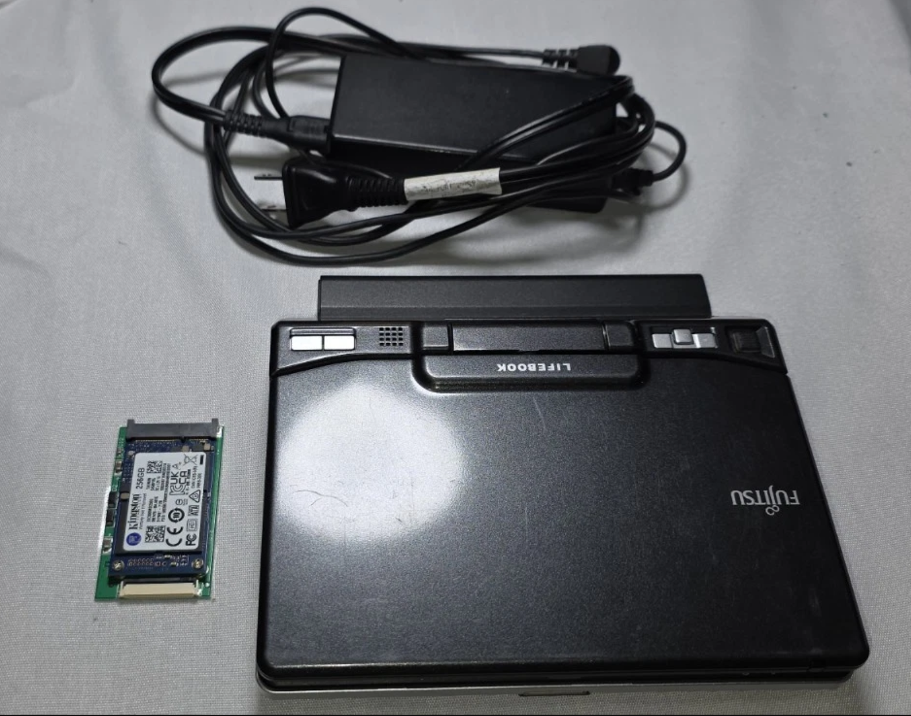

# toshiba-lifebook-u810
Repo for tracking my setup &amp; upgrades on toshiba lifebook u810

### Plan
- [ ] install Alpine Linux x86 just CLI
- [ ] minimize the heat it generates
- [ ] get the tablet working 
- [ ] run [aseprite](https://github.com/aseprite/aseprite) and [mtPaint](https://mtpaint.sourceforge.net/) without window manager/desktop

### Tools
- ripgrep, fd, fzf, zoxide
- eza, tree
- git, gh
- neovim, mini.nvim
- ffmpeg, imagemagick, gifsicle [feh](https://github.com/derf/feh)
- tmux, rxvt-unicode
- w3m, links, elinks, lynx
- pass

### Ebay

**Ebay post**: Sold as shown in the photo, working, used, and comes with an SSD+adapter( I've already replaced and installed the system. It worked fine, but after a while, the SSD started throwing an error. I think the SSD itself is defective and needs to be replaced. The adapter works fine) you know the system, you can replace HDD with an SSD. And recommended install a new operating system Windows 7 lite.

Cost, shipping included: $263.47

Also bought: 
- Netely Wifi 6 AX200HMW (wifi replacement card), $27.16
- 32gb Sandisk SD card SDHC, $19.60
- KingSPec 32gb 1.8" SSD-ZIF, $83.72
